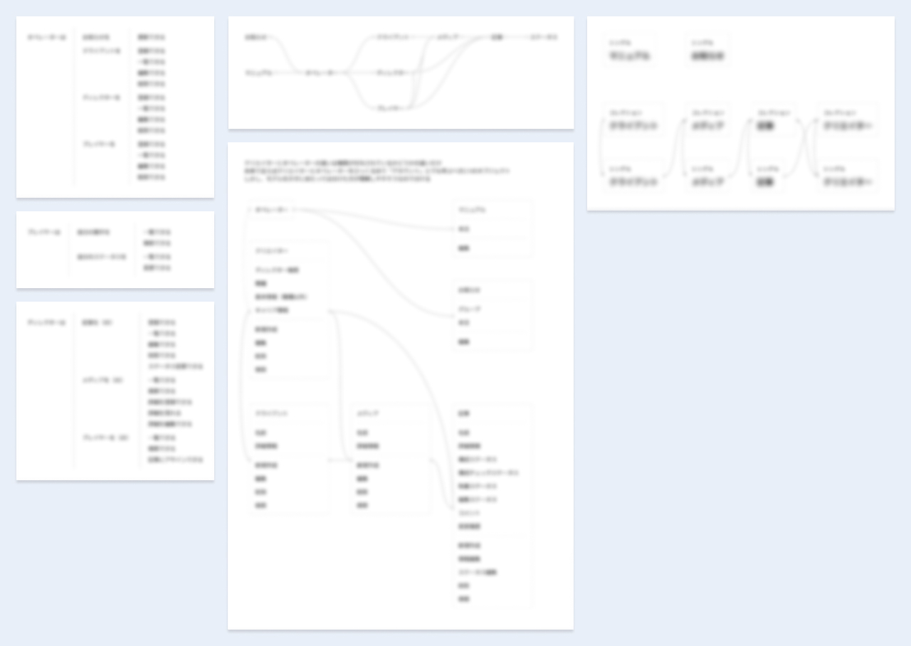

メディアエンジン株式会社様の記事制作ディレクションシステム。

既存の社内向けツールをアップデートするプロジェクトに参加しました。
担当範囲は課題の深掘りから UI モックアップの作成までです。

## 最終的な成果物

- 既存の機能は大きく変更しない
- ナビゲーションやラベリングなど、情報設計を見直す
- シンプルな Master-Detail パターンに組み替える
- Material Design に準拠したコンポーネントを使用する

詳細にはお見せできませんが、以下のようなモックアップを制作しました。

## 簡単な状況説明

詳しくは記載できませんが、ツールを取り巻く状況は以下のようになっていました。

- 記事制作において、社内で制作ツールを使用してディレクションをしている
- ツールを使用するのはディレクターやライターなど記事制作に関わる人
- 社員も外部パートナーも使用する

## 既存システムの課題とデザインの方向性

相談いただいた時点で、大別すると以下の課題がありました。

- これまで社内にデザイナーがいなかったため UI の見た目がツギハギになっている
- 業務フローと、システムの機能や UI が上手く対応しきれていない
- 機能としては存在していてもユーザーが知らない・扱いきれないものもある

これらの課題の解決と今後の運用を考えて、以下のように進めることに決定しました。

- 社内ユーザーへのインタビューをもとに UI に落とし込む
- 私が作って終わりではなく、デザイン制作の考え方をメディアエンジン様に伝えながら進める
- 今後メディアエンジン様の中で運用・改修が出来るように UI フレームワークを使用する

進め方自体も相談いただいていたため、ディレクションの一環でこのように提案しました。

## 社内ユーザーへのインタビュー

初めは、実際にシステムを使用しているユーザーへのインタビューから実施しました。
このステップではトークスクリプトの準備を含めたインタビュー設計と、当日のモデレートを担当しています。

発話プロトコル法を用いた半構造化インタビューを計 7 回行いました。
プロジェクトの期日の関係もあり実施人数はやや少なめですが、多くの課題を発見することが出来ました。

その中でも特にフォーカスしたのは以下の 2 点です。

- ディレクター職は見るべき箇所が多い
  - それが色々なページに点在しているため効率的にシステムを使用できない
- 逆にディレクター以外の職種が見るべき箇所は少ない
  - しかし画面に表示されている要素は多いため、肝心の見るべき箇所が埋もれている

また、それ以外の箇所についてもインタビュー結果と分析をまとめてレポーティングしました。

多くの課題が見つかりましたが、期日や予算の関係ですべてを解決することは難しかったため、一部の点にフォーカスしてアップデートを行うことにしました。
その結果最初に挙げたような、機能そのものの追加はせず、ナビゲーションなどの変更にとどめました。

## UI 制作の考え方を伝えながらの進行

若干要件からは外れるのですが、私は「情報設計や UI 構築の理屈を伝えないまま、完成物だけを納品してもあまり意味が無い」と考えていました。

というのも、事前ヒアリングで「社内にデザイナーがおらずエンジニアが都度改修を施している」と伺っていたからです。
市場全体でデザイナー採用が難しい今、しばらくは似たような社内状況が続くだろうと勝手に推測したのです。

こういった状況で制作パートナーとして私に出来ることは何か。
考えた末の結論は「**UI 制作の原理原則をレクチャーすることで、現在のエンジニアメンバーが将来もスムーズに運用できたら価値がある**」でした。

外部のデザイナーとしては差し出がましいかもしれませんが、提案した際には快諾していけだけました。

実際に行ったこととしては、オブジェクト指向 UI のモデルやインタラクションの説明や、よくあるアンチパターンの解説などです。

もちろんすべてを説明できたとは思いませんが、多少なりとも UI 制作のプロセスをオープンにできたと思っています。

## 運用・改修がしやすいように UI フレームワークを使用

前のセクションの話と多少繋がりますが、今回アップデートしたとしてもその後上手く運用・改修できなくては意味がありません。

せっかく依頼いただいているのですから、作って終わりではなく、長く価値を発揮するものを作りたいと考えました。

アップデート前の UI は Vuetify によって Material Design を実装していたため、使用する技術は変えないまま制作することに決めました。

実は私はこの時点で Vue を使った経験がほとんどありませんでしたが、急いでキャッチアップをしました。
幸いドキュメントが充実しており、そこまで苦戦することなくコンポーネントを選んだりレイアウトを組めました。

既存のコンポーネントの使い方が、本来想定されている使い方と異なっているような箇所もあったため、一部はドキュメント通りになるように手を入れました。
Material Design がどういう Principles を定義しているかといった話を交えて、今後入れ替えたり拡張したりしやすいようにしました。
