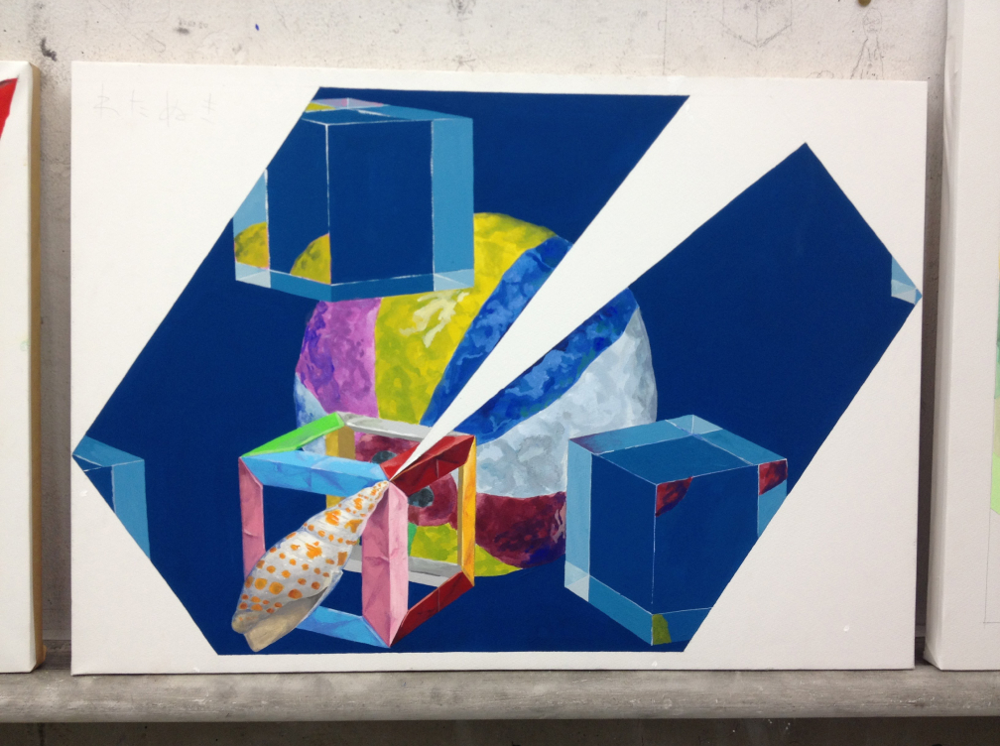
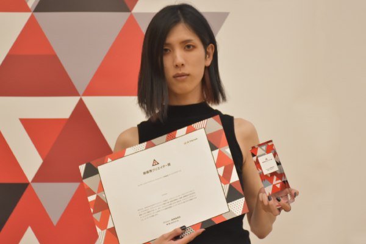

1993 年生まれ、大学を卒業後にエイチームに就職。現在はインクリメンツに所属しています。

業務では UI 作成から一部フロントエンドの実装までを担当。

個人でも Web サービスやアプリの開発をしており、このサイトも 1 から作成しています。アイデアルデザイナーを標榜中。

## 私が出来ること

- 画像編集、グラフィック、エディトリアルなど静的なスタイリング
- モーショングラフィックス、動画編集など動的なスタイリング
- プロトタイプ作成やユーザーテストなど、UX デザイン
- 設計から実装まで、ビューに関わるコーディング全般

<!-- gatsby-transformer-remarkがgifに対応していないため、staticディレクトリに配置する -->

## 普段の私

[Twitter](https://twitter.com/xrxoxcxox)と[note](https://note.com/xrxoxcxox)によくいます。

Twitter では日頃のちょっとした気付きやアイデア、あるいは制作の状況など。note ではデザインについての考え方や理想を綴っていることが多いです。

良かったら是非声をかけてください。

## デザイナーを志した理由

### 始まりは高校受験の頃

中学 2 年の終わり頃、進路を決める時期の話です。

自分は当時“将来やりたいこと”が全く見つからず、志望校を決めなさいと言われてもピンと来ていませんでした。

両親に「**勉強をするのも面倒くさいし、勉強せずに入れるぐらいの高校に進むんじゃダメかな？**」と素直な気持ちで打ち明けました。

そこで言われたのは、要約すると以下の 2 点です。

- 頭の良い人が学歴の関係ない職業に就くのは難しくない
- 勉強してこなかった人間が学歴の要る職業に就くのは難しい

学歴主義な親ではなかったので差別的なニュアンスではなく、それでいて理にかなっているなあと頷ける話でした。

合点のいった私は“**夢がないから勉強する**”と決め、地元ではそれなりに頭の良い高校に合格しました。

<small>ハードディスクの中にあった一番古いイラストです。恥ずかしいですが、昔の絵の中ではかなり気に入っている2枚です。</small>

### 大学受験で「気づいた」

時は経ち……今度は大学受験のシーズンです。

志望校を決めるにあたって、初めは「周りのみんなと同じような学校で良いかな〜」ぐらいの考えでした。

しかし、高校受験の頃も“**特に夢が無いから妥当な判断**”で志望校を決めたことを思い出します。

高校に引き続き大学までそんな決め方をしたら、自分の人生はずっと**妥当なもの**になってしまうような気がしました。

じゃあどうすれば人生が豊かになるんだろう？考えて自己分析を始めました。

これから何十年か、自分の人生を賭して打ち込めるものは何だろうと悩み、出した答えが“**イラストを描くこと**”。

当時は絵を描くことが好きで、描き始めて気がついたら日が昇っていた……なんてこともあります。

これだけ好きだったら後悔しないはずと確信し、美大受験へと切り替えました。

当時は偏差値で言えば 70 以上あったのでかなり無茶な進路変更だったはずです。

しかし今こうやってデザイナーとして仕事をしていて、我ながら良い判断をしたと感じています笑。

<small>浪人中の色彩構成、おそらく受験の直前に描いていたもの。</small>

### デザインの楽しさに気づいた大学生活

イラストレーターになりたかった自分ですが、入った大学はデザイン科でした。

憧れていたイラストレーターさんの経歴を調べたところ

**デザイン系の仕事 → 独立してイラストレーター**

というパターンがよく見られたのでそれに倣おうと考えていたのを覚えています。

しかし授業でデザインの力や考え方を教わるにつれ、デザインの楽しさに気づいていきました。

また、この後のセクションで詳しく書いていますが、自分の人生の中で ideal を生み出すためにはどうしたら良いかをしょっちゅう考えていた時期でもあります。

大学生のうちに自分のやれることの種を増やそうと思い、グラフィック・Web・映像・プロダクトと色々なジャンルに手を出していました。

未経験の領域を学びに行くフットワークはこの頃身に付けたのではないかと思います。

<small>卒業制作、サインシステムに使用する想定のフォント。サインの実寸を再現したらこのサイズになりました。フォントは一番のめり込んだジャンルです。</small>

### エイチームに入社 → 今に至る

大学卒業後は[エイチーム](https://www.a-tm.co.jp/)に入社し、現在も在籍中です。

見た目を作って終わりではなく、長い時間をかけてプロダクトを育てる働き方にやりがいを感じています。

データからユーザーさんの期待や迷いを分析して改善するなど、少し前までは想像もしていなかった“デザイナーの価値”にたくさん出会えました。

インハウスの特性上、このポートフォリオには実績を載せられませんが引き続き精進していきます。

<small>社内の表彰式で“最優秀クリエイター賞”をいただいたときの写真。緊張しすぎて顔がこわばっています。</small>

## 未来史

将来何をしていたい。どのようになっていたい。と未来の年表を書いて常に意識しています。

もともと自分が見るためだけに書いていましたが、共有する機会も多くなってきたのでこちらにも掲載。以下が最新版です。（2020 年 1 月更新）

### 死ぬ日 2060 年くらい（70 歳前後）

- 生活がカスだから平均寿命まで行かない気がする、のでとりあえず 70 歳頃死ぬとする
- 「あのとき作った ◯◯ は ideal。これを超えるものは無い。」って口に出して死ぬ

### 2053 年（60 歳）

- 日本の大半の人が美しさの中で過ごして、美しい営みをしている
  - 2020 年の現在と比べるとこの頃は大半の人間が入れ替わっているはず
  - そのときには日本の文化が丸ごと変わっている

### 2043 年（50 歳）

- 政治をデザインで変えて日本を良くしている
  - 直近 5 年の投票率は年々上がっていってる
  - 20 代 30 代の層が政治に興味を示し、投票しに行かない人はほとんどいない
  - 自分たちで国を良くしていける、という気持ちを国民が持てている
  - そういう変化を起こすための仕組みを作り、貢献している
  - 政治家になるのは何となく違う気がするので、別なアプローチで政治に関われないか……
- 小学生でもかなり当たり前に“美しさ”の中で生活している
  - 今の日本にある“美しくないもの”に触れたこともないような……

### 2033 年（40 歳）

- 政治にデザインを組み合わせ始めている
  - 特に最初の頃は反発がすごい
  - 政治ことなんか何も分かってないのに……などめちゃくちゃに言われている
  - 誰か 1 人、立場が強い応援者が側にいてくれている
- 中高生、大学生はかなり美意識が醸成されていて目が肥えている
  - 若い人への訴求で、美しくないものは眼中に入れてもらえない
  - 更に上の世代（30over くらい？）の美意識はまだそこまで向上していない
  - 世代間の対立を煽らないようにしたい

### 2028 年（35 歳）

- 大学や私立高校のカリキュラムにデザインがよく登場するようになる
  - 教育関連の事業の成果でエイチームがよく呼ばれる
  - メディアにもよく出る
- 2024 年頃に始めた事業が成果が出てきて、一部のセグメントにとってのインフラと化す
  - ユーザーにとってもインフラだし、新しく始める事業にとっての支えにもなっている

### 2026 年（33 歳）

- 2024 年に作ったプロダクトが死ぬほどパクられつつも、エイチームのものが 1 番使われている
  - プロダクトを通して実現したい世界が明確で、ユーザーにも伝わっている
  - そのプロダクトが好きだからエイチームに入りたい人もよくいる
- 2021 年頃より外部メディアにデザインのことで露出
  - 現在の「ゲームを作ってる会社」から「ユーザー視点を突き詰めたサービスによって利益を出して成長し続ける会社で、ゲームや web サイトなど領域も広い」といった認知に変わりつつある
- 今でいう FLASH のように何かが消えている
  - 何かの技術だけに固執して生きないようにしておいて、上手く切り抜ける

### 2025 年（32 歳）

- 2023 年頃に始めた新規事業が一部の層には人気が出ている
- A の場所で利益が出ているから B の場所は愛や美学だけで運営する、を実行する
  - Apple が無形のプロダクトだけで全体の利益が出るようになったので（理論上は）有形プロダクトで利益を求めなくても良くなったような、そういう世界
- 会社、あるいはプロダクトがユーザーから応援される存在になっている
  - ロジックというより感情で
- デジタル庁と民間企業が手を取って、時代錯誤な法律や慣習が少しずつ無くなってきたと実感できる
  - 印鑑など
- 日本のデザイン全体に対して GitHub とか Figma Community 的なものを通じて貢献している
  - 昔でいう jQuery のように「迷ったらこれを使えば大丈夫」と思われるようなものを世の中に提供できている

### 2024 年（31 歳）

- 熱量で世界を引っ張るプロダクトを作る子会社・部署が出来ている
  - 既存のセクションはクレバーなマーケティングが多い、熱いタイプのセクションが加わってより成長する
  - 2022 年の話の延長
- 教育に関わる事業を始めている
  - 考えるだけでなく、自分で手を動かし発信する人を育てるような教育
  - 大学と連携して、産学協同のような場面にエイチームがよくいる
- 社内の人間は職種関係なくある程度コードを書いてプロダクトを触れる
  - ビジネス職でも全く書けない人はいない
- 何か世界に新しい技術が存在しているだろうから、それを取り入れられている
  - 石炭の時代における石油とか、ワープロの時代におけるパソコンとか、そういうもの
- イベントなどに登壇して影響力を持っている
  - デザイン単体のイベントもありつつ、デザイン経営のようなものもある
  - イベントを開く側にもなっている

### 2023 年（30 歳）

- 全社的な経営の判断にデザインやものづくりの視点が当たり前に入っている
  - 役員クラスのデザイナーが 1~2 人
  - 利益を出すのは当然、その上でどう世界や人間を良くするのか？の話をする
- 「今この瞬間はお金にならないけど、○ 年後の日本の基盤になる」ような新規事業を作れる環境になっている
- 美意識が育まれた企業になっている
  - デザインがイマイチなのは競合劣位だ、というのが社内の常識になっている
  - デザイナー出身の事業責任者が 2 人、1 人は入社 3 年以内の人
  - 日本の他の企業への優位性
  - ロジカルさのコモディティ化から脱却
  - デザイナーでない人でも、世間の会社のジュニアなデザイナーより美意識が高いレベルまで育成
- リサーチャーやアナリストのような役割が一般的になっている
  - 人々の特性・組織の課題に合わせて今よりも多様な役割が次々生まれて機能している
- デザイナー採用でエイチームのカルチャーに惹かれつつ「ここで働けば自分のスキルも成長できると思った」「エイチームの ○○ というプロダクトに携わりたくて」という応募を全体の 7 割にしている
- UI デザインのなかでも GUI デザイン・VUI デザインなどが分化している
  - 各自自分の強みが何かを模索している
  - 上手く掛け合わせて自分のポジションを確立している
- Figma Community（もしくはそれに類するもの）がもう少し再利用性の高い仕組みになり、デザイナーが個人で何かを完遂することが減り始める

### 2022 年（29 歳）

- エイチーム全社の CXO（あるいはそれに類するポジション）に就いている
  - 子会社のときは Creative に責任を持つので CCO
  - 全社ではものづくりだけではなく人生におけるエイチームとの関わり方、といった設計をするので CXO
  - 全体のプロダクトを統合してユーザーの体験も自社の利益も高くなるように牽引している
- 「Ateam Brand」の明文化と外部発信でブランド価値を高めて、定性的なスコアを伸ばして利益に貢献している
  - 「Ateam People」と同じような立ち位置で、外にも中にも浸透を図る
  - Public Relation のうち販促以外に責任を持っている
- イベントなどに登壇して影響力を持っている
  - 主にデザイン系のイベント
  - 自分の発信力が会社にとって良い影響をもたらすレベルを目指す
- 今ある事業は「安定して利益を出す役割」で、これから作る事業のうちいくつかは「世の中を楽しくする・プラスにする役割」として役割が分かれつつある
  - 会社を永続的に成長させるためには、既に見えている市場に飛び込むだけではいけない
  - これぐらいの時期にはまだ市場やニーズがよく分かっていない場所にも飛び込む文化がある
- ライフスタイルサポート・エンターテインメントの垣根を越えて、社内を横断してデザイン向上のための組織や動きが興っている
  - デザイン向上が成果になることを誰も疑っていない
  - そこに時間やお金をかけることは当たり前の意識
  - 更にコーポレート部門の中にもデザインや開発のグループができる
- デザイナーの社内実績を公開可にして、社内の価値だけではなく市場価値も上げられる状態
  - エイチーム出身だと市場平均より 100 万円は高い給与で転職できるような
  - ただしそんな条件が出されるにも関わらず、あえてエイチームで成果を出したいと思えるような場所へ
  - 事業はもちろん事業以外での制作もどんどん公開して、それが PR にも繋がっている
- デザイン組織も数段レベルアップして、新しく入ってくる人は今の綿貫なんかよりはるかに上になっている
- 社内の人間は職種関係なくコードを書くことを求められ始めている
  - 職種は関係なく、ある程度エンジニアリング的な思考をもって話を進めている

### 2021 年（28 歳）

- Increments の CCO（あるいはそれに類するポジション）に就いている
  - Chief Creative Officer
  - デザイナーの領域そのものを拡大しつつ、更にその中でトップに
- Increments がエイチームの中で明らかにデザインのレベルが高い場所になっている
  - ちょっとやそっとではなく、圧倒的な差を作る
  - 他の組織から目標にされるような場所
  - 目標にされてみんなが研鑽することでエイチームレベルをグッと上がる
- Increments のデザインの取り組みを外部に発信し続けることで、デザイン面での信頼や価値を作り出す
- 組織のレベルアップに自分の時間を多く使う
  - 利益を求めるために・スキルを上げるために主体的に無茶苦茶やれる人を育てたい
  - デザイナーの美意識・デザインの知識や力を引き上げる
  - デザインスキルだけでなく、ビジネスやエンジニアリングとデザインを結び付けられるための育成をしていく
- 組織とはどのようにして変化するのか、意思決定をするのか、などを理解する
  - 理想論を語るだけではなく、現状の酸いも甘いも理解してその上でより良くしていく
- デザイナーが絶対に戦略を立てる段階から参加する文化にしている
  - 「事業が始まるときにはデザイナーも参加してくれないと困る！」な求められ方
  - 「あとは見た目を作るだけ」を根絶する、絶対に
  - デザイナー出身の事業責任者が 1 人
  - 逆にただのスタイラーやコーダーはいない
- 作るもののクオリティについて、デザイナーが（良い意味で）一番厳しい組織になっている
  - スピードは落とさない
  - クオリティも妥協しない
  - トレードオフじゃなくて両立する
  - それを定時内に
  - という組織になっている
- Tips 含めた日々のアウトプットで、自分の近くにいる人達にとっての貢献が出来ている
  - 社外の人だけど普段からやり取りする、くらいの距離感の人達
