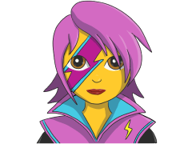

私はWebデザイナーをしていて、いわゆる事業会社に勤めています。毎日サイト改善をしているのですが、あるときふと気がつきました。

**「これは私が作りました」と言えるものがありません。**

あるページを新規で自分が作っても、改善の中では他の人も触ります。そして逆もまた然り。どこからどこまでが誰の制作実績かなど明確にできるはずがないのです。

チームで協力して1つのプロダクトを良くしていくこと。それ自体はとても魅力的でやりがいがあります。ですがデザイナー市場での価値を考えたらどうでしょう。制作実績を1つも出せないデザイナーを誰かが信頼してくれるのでしょうか。

危機感を覚えた私はポートフォリオを作ることにしました。会社での活動とは別に、自分の作ったもの・自分はどういう人間かを記録し、生きた証を作らねばという気持ちが強かったです。

現状制作実績として載せられるものは少ないですが、このポートフォリオが出来ていく様を記録し、それ自体を1つの作品として仕上げようと考えています。

以下にこのポートフォリオの制作プロセスを記していきます。

## ポートフォリオサイトを作るという判断

アウトプットの形そのものをユニークに考えようかとも思いました。しかしデザイナーという役割において、ポートフォリオを作って見せる/見てもらうという文脈は非常に強固です。巨人の肩に乗ることが目的達成のための近道だと判断しました。

また普段の業務で担当しているのはビジュアル作りやマークアップですが、サイトの構築全般を自分で一通りやることでスキルアップもできます。

新しいチャレンジも出来るし世界とのコミュニケーションも図れる。ということでサイト制作に取り掛かりました。

## サイト名の表記の由来

目に見えるものを作る前に、まずはサイトの名前を考えました。本質的でないと思われるのかもしれませんが、自分は「呼び名があることでモノをモノ足らしめる」と考えています。ですから最初に時間をかけました。

はじめに悩んでいたのは「制作過程も含めて作品、として公開すると決めたものの……ほとんど何もないサイトをポートフォリオと言い切るのはどうなんだろう？」でした。

悩んでいたのもあって、あだ名を取り入れるとどうかとか、ずっと使っているIDを今回も使おうか、などと堂々巡り。しかしフッと気づいたのですが、本名の**“Keisuke Watanuki”**と**“Portfolio”**を並べると**“WIP”**が含まれていることに気がつきました。

ダジャレですし、捻りもありませんが名が体を表しています。なんだかやけにしっくり来ました。

そういうわけでW, i, Pだけ色を変えて、まさに今製作中のポートフォリオであることを強調しています。

## 制作のポリシー

「なんだかオシャレだけどどんな人が作ったか分からないポートフォリオは嫌」が第一。制作プロセスやアウトプットに至る背景がよく分かるようなものにしたいと思っています。

何を作るにしても、完璧に作り切って初めて公開するスタイルは今や求められなくなってきています。ポートフォリオであっても素早く世に出し素早く改善することをポリシーとします。

もちろん現在もまだ制作途中です。

## 使っているツール・技術

### ビジュアル制作ではFigma

Figmaは各種デザインツールの中で最もコンポーネントの管理がしやすいと思っています。特に色やテキスト。自分はSketchでの管理には少々不満がありました。

例えば、テキストスタイルの色は「色のシンボル」から選択することができません。またレイヤースタイルにしても塗りと線の定義が必要な場合は都度登録が必要。若干WETに感じます。

そんな中Figmaのコンポーネントの設計は非常に惹かれ、「次にプロダクトを作るとしたら絶対Figma！」と決めていました。

### サイトジェネレーターとしてGatsby

たまたまですが、会社の中でも外でもReactを使う機会が増えてきており勉強したいと思っていました。ポートフォリオサイトにReactはオーバースペックかな？と思っていましたが、静的ジェネレーターのGatsbyを発見。

Reactの中でデザイナーとして学んでおきたい機能はカバーできそうでしたし、良い訓練になりそうだと思い選択しました。

同じようなインターフェースを何度もマークアップしなくて済む、という点だけでもデザイナーがReactを学ぶ価値はあると思っています。

初めのうちこそ苦労しましたが、ほとんどカスタマイズしなくてもBlazing Fastに表示してくれるなどリターンも大きかったです。

### Emotionによるスタイリング

CSS in JSによるスタイリングはどのライブラリを使っても一長一短で悩ましかったですが、Emotionを使うことにしました。かなり後発なライブラリだけあって「出来ないこと」がほとんどありません。

実はEmotionに決めるまでにstyled-componentとstyled-jsxで1度ずつ全てをスタイリングしており、その上で判断をしました。長い目で見たときにつらくならなそうだと感じたためEmotionを採用。

### ホスティングはNetlifyで自動的に

一番最初に公開したときはロリポップ!のレンタルサーバーを借りていて、FTPアップロードしていました。

しかし、コードはGitで管理しているのにデプロイ時には毎回手作業で差分のファイルをアップするというのも変な話です。

いくつか候補は上がりましたが、初期設定も日々のデプロイ作業も極力簡単に済ませたかったためNetlifyに落ち着きました。

現在はmasterにマージするだけでデプロイが終わる環境です。

## GitHubのリポジトリ

[こちらがこのサイトのリポジトリです。](https://github.com/xrxoxcxox/playground)

GitHubはアカウントこそ持っていたものの全く使っていませんでした。自分でサイトを1から作るにあたってリポジトリを作成したので公開します。