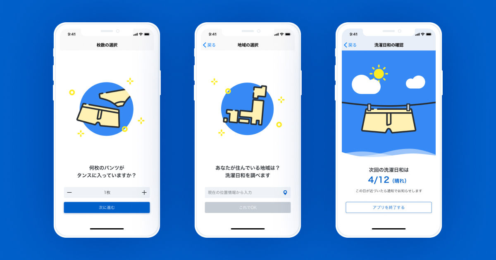
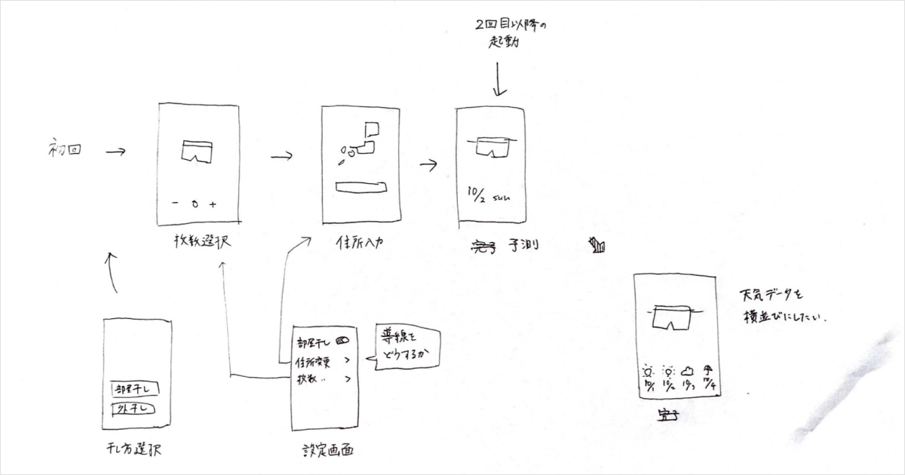

洗濯日和サジェストアプリ ARAUHI。手持ちのパンツの枚数を入力するといつが洗濯日和かを教えてくれます。

[アプリのダウンロードはこちらのリンクから](https://apps.apple.com/jp/app/arauhi/id1493001313?ign-mpt=uo%3D2)

私は UI の設計全般と一部の実装（Storyboard 上）を担当しました。

リンクを貼りましたが「**それらしい見た目や動きをしているにも関わらず、人の役に立たないものを作ろう**」とスタートしたプロジェクトです。

有り体に言えば**クソアプリ**を作ることを目的としていました。

## アプリ開発の始まり

会社の同期 3 人でご飯を食べながら

「普段はロジカルに最短距離で成果を出すように心がけているけど、たまには完全にバカになって何かを作りたい。」

「自分たちの力だけでアプリを 1 から作ってみたい。」

「やってダメな理由は 1 つも無いし、作っちゃうか〜。」

ということでアプリ開発がスタートしました。このとき決めていた内容は以下の 3 つです。

- 人の役に立たない、ギャグみたいなアプリを作る
- 企画はギャグみたいだけど作りはちゃんとしている
- アプリはアプリでもネイティブアプリを作る

冒頭にも書いたほど最初の項目を一番大事にしていました。

人の役に立ってはいけない……非常に大きな制限です。クリエイティビティとは制限の中でこそ生まれるものの、流石に普段の仕事ではこのお題には挑めません。
だからこそ個人開発で取り組んでみました。

……というのは後から考えた内容で、実際は「そんな馬鹿げた条件でものを作ったことがないから楽しそう」で決まりました。

## アプリ内容の企画と決定

まずは**真面目に話し合わない**ために、飲酒から始めました。

たしか「サイゼリヤで豪遊すると気分が良いのにお財布に優しい」みたいな理由でワインをたくさん頼んでいた気がします。

程よく酔っ払ってきた時点で話し合いを始めた訳ですが、私たちが作る企画はギャグみたいな内容でなければなりません。そのため“**人々にとって課題でも何でもなく、現時点で解決方法が明らかなもの**”を出し合いました。

その結果“**手持ちのパンツの枚数を入力すると、次はいつまでに洗濯すればパンツのストック切れを防げるかを教えてくれる**”アプリを作ることに決定。

<small>(本来であれば自分たちの足跡として、話し合った内容が記録してあるのがベストです。 しかし酔っ払い3人がサイゼリヤで話した内容が詳細に記録されているはずはありませんでした。）</small>

## UI 制作

企画が決まったところで制作に入ります。

前提として、このアプリは次のように使用します。本来は画面遷移をする必要もないのですがアプリ制作の練習の一環として組み込んでいます。

1. 手持ちのパンツの枚数を入力する
1. 普段の洗濯は外干しか部屋干しかを選ぶ（計算ロジックの関係上）
1. 郵便番号を入力する
1. 次の洗濯日和を知る
1. その日が近づいたらアプリからの通知を受け取り、洗濯をする

更にスプラッシュスクリーンとステートが変化する画面が加わる&デバイスサイズ毎に別れます。

以下が View の一覧です。（実際に使っている Figma の画面を埋め込んでいます。もし良ければ元データにアクセスもしてみてください。）

<iframe style='border: none;' width='100%' height='320' src='https://www.figma.com/embed?embed_host=share&url=https%3A%2F%2Fwww.figma.com%2Ffile%2FDEC7sX7e9aSMLq0Vv5YnS1kI%2FARAUHI%3Fnode-id%3D0%253A1' allowfullscreen></iframe>

正直に言ってユーザーから見た動作は至極単純なものなので 1-2 つの入力欄とボタンさえあれば十分です。

しかしそれでは画面の中の情報が余りにも少ないです。グラフィックの良し悪しではなく「**今、画面が変化していますよ**」とユーザーにフィードバックする手立てが少ないことが問題です。

（もちろん Segue は設定してあるので遷移アニメーションはするのですが、開発者の私たちでさえも画面が変わったかどうかを見過ごすほどでした。）

そのため各画面ごとに種類の違うイラストを用意して視覚的に**変化していること**のフィードバックを提供しました。

## デザインガイドライン

ごくごく簡単な内容ですがデザインガイドラインも制作しました。こちらも実際の Figma のデータを埋め込みます。

<iframe style='border: none;' width='100%' height='320' src='https://www.figma.com/embed?embed_host=share&url=https%3A%2F%2Fwww.figma.com%2Ffile%2FDEC7sX7e9aSMLq0Vv5YnS1kI%2FARAUHI%3Fnode-id%3D0%253A242' allowfullscreen></iframe>

デザインガイドラインというと[Atlassian Design](https://atlassian.design/)や[Lightning Design System](https://www.lightningdesignsystem.com/)などが浮かぶのかもしれませんが、ここまで大規模なガイドラインが必要な場面は少ないと思います。

今回作ったアプリを含め、色やフォントのスタイルなどが指定出来ていれば十分な場合も多いです。

いずれにしても綺麗に網羅的なガイドラインを作ることが目的ではありません。デザイナーとエンジニアの間でコミュニケーションが取りやすくなれば OK と考え、このレベルでの作成にとどめています。

## Special Thanks

最後に、一緒に制作をしてくれた[Hajime](https://github.com/hytkgami)と[ka1ryu](https://github.com/ka1ryu)には感謝の気持ちで一杯です。2 人ともありがとう！
