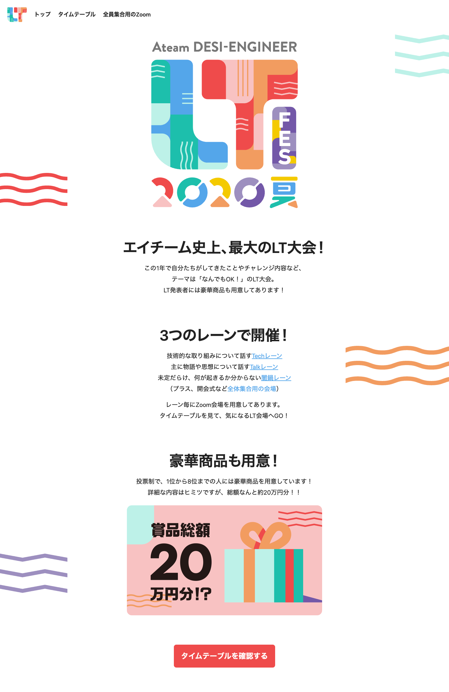
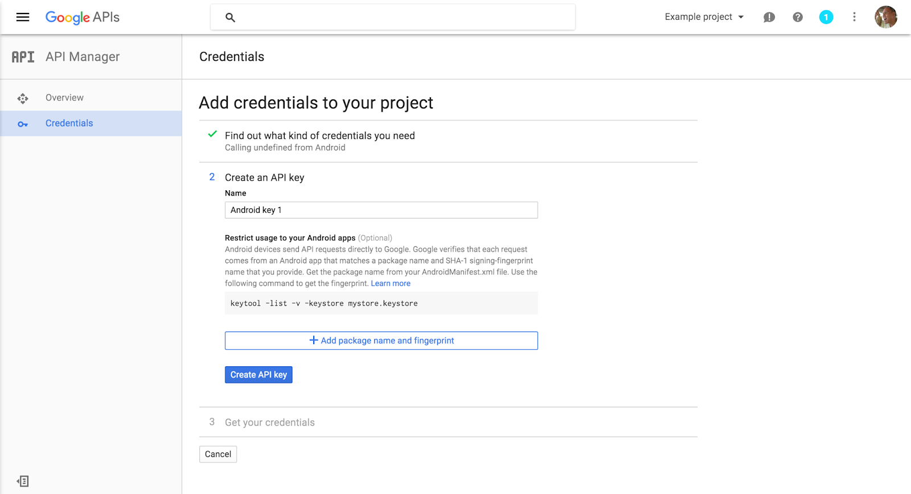
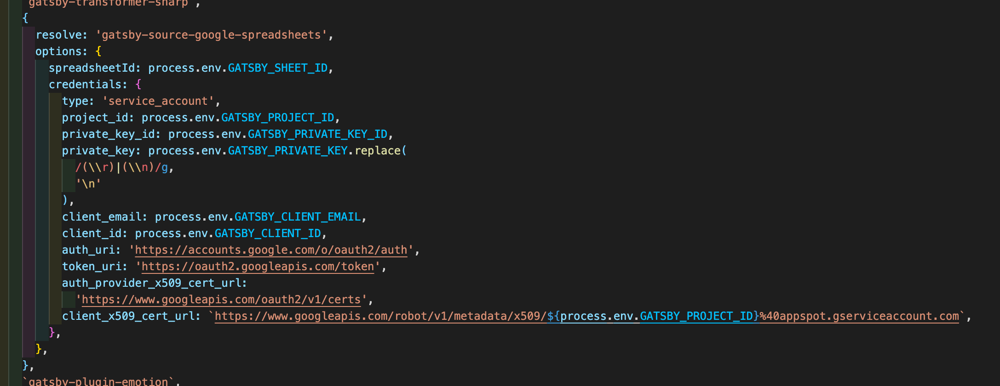
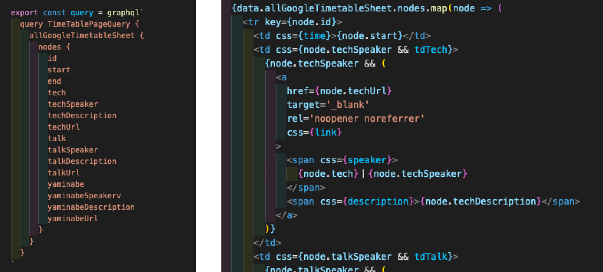
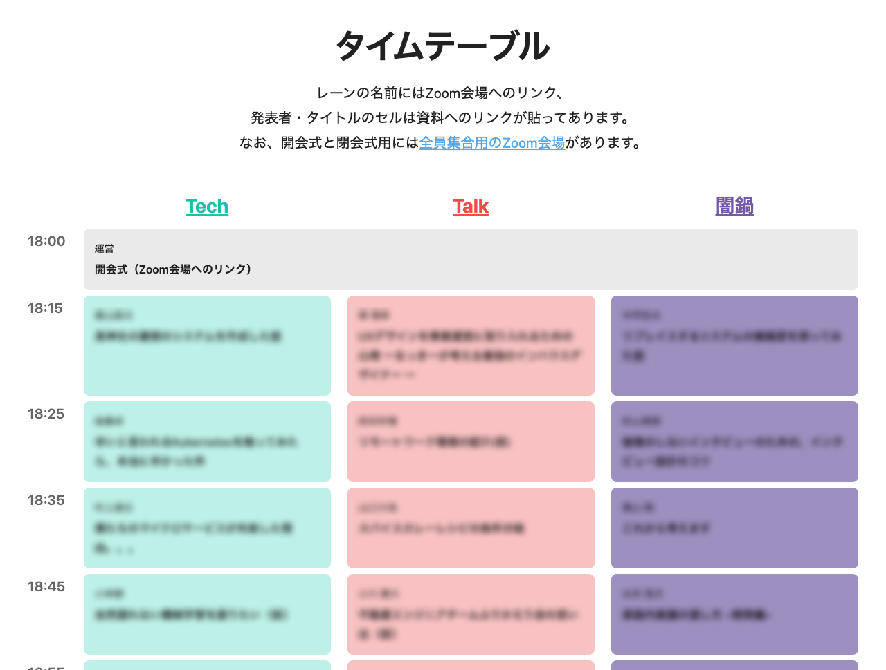
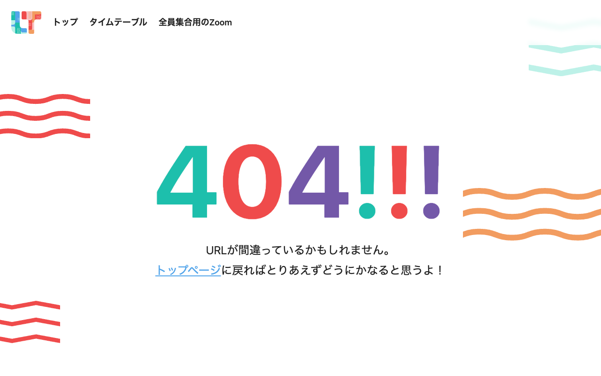

2020 年 7 月 17 日（金）、ライトニングトーク（以下 LT）大会「Ateam DESI-ENGINEER LT Fes 2020 夏」を開催しました。発表者は 64 名でエイチーム史上最大の LT 大会となり、私は主にイベント用サイト制作をしました。

このイベントの詳しいレポートは[エイチームコーポレートサイトでのコラム](https://www.a-tm.co.jp/recruit/news/column-18000/)に掲載されています。よろしければこちらもあわせてどうぞ。

## イベントの興り

エイチームグループのエンジニアやデザイナーの横断的なコミュケーションを活性化し、ノウハウや知見の共有を行うことで、事業やサービスの成長につなげることを目的に開催。

当時「COVID-19 の影響もあって、普段と比べると雑談やプラス α な動きが減っているよね」という課題を感じた一部メンバーから発案があり、有志を募ってイベント運営が始まりました。

## 私の担当

- イベント特設サイトの制作
- 各種スライドの制作
- デザインレビュー全般

以上が私の主な担当でした。
その中でも特に特設サイトに焦点を当てて紹介します。

この特設サイト、実はイベントの必須要件として存在していませんでした。

最初の最初は「タイムテーブルの公開とかを特設サイトっぽくしたら『イベント感』が出るのでは？」という言わば思いつき。

少し裏話をすると、このイベントは当初はエンジニアだけで実施予定でした。

しかし「イベントの興り」で記載したように、目の前にあった課題はエンジニアだけに限ったものではありません。

そのため「デザイナーも一緒にやった方がより効果的ははず！」と、少し遅れてデザイナーからも参加を募るようになりました。

そして、私が運営に参加することになって「せっかくデザイナーが運営にいるなら」とスコープを広げていきました。
イベントロゴ、表彰の進め方、Zoom 背景……と話を膨らませる中で特設サイトも挙がり制作に至ったわけです。

## 使用技術とポイント

「使用技術」と呼べそうなものはこのような具合で、GatsbyJS・Google Sheets API・Emotion を挙げます。
Gatsby を使っているので React と GraphQL は必然的に使うのですが、記載はしています。

### ポイント 1 blank の starter から作った

Gatsby で新規プロジェクトを作るときは、以下のコマンドのようなイメージで何かしらの starter を下敷きにして作ります。

`gatsby new [SITE_DIRECTORY_NAME] [URL_OF_STARTER_GITHUB_REPO]`

ですが、今回はチャレンジも含めて[gatsby-starter-hello-world](https://github.com/gatsbyjs/gatsby-starter-hello-world)という全く blank の starter から作りました。
公式の説明も以下のように説明されている starter です。

> - A no-frills Gatsby install
> - No plugins, no boilerplate
> - Great for advanced users

そもそも Gatsby は単体で成立するものではなく、色々なプラグインを追加して動かすようなものです。

適切な starter を選ぶと、プロジェクトを作成した時点で画像を軽く処理してくれたり最低限の SEO を上手にやってくれたりと、多くの便利なプラグインがが入っています。
ですが今回選んだ starter には何のプラグインも入っていません。

最終的に、使ってるプラグインは以下の 6 つです。

- gatsby-source-filesystem
- gatsby-plugin-sharp
- gatsby-transformer-sharp
- gatsby-source-google-spreadsheets
- gatsby-plugin-emotion
- gatsby-plugin-react-helmet

### ポイント 2 Google Sheets をソースにした

上で挙げた中でも特に大事なのは gatsby-source-google-spreadsheets です。

Gatsby は GraphQL でデータを取得するのですが、このプラグインを入れることで少しの設定をするだけで、Google Sheets のデータに GraphQL からアクセスできます。

具体的には、まず Google Developers Console から Google Sheets API をウィザードに沿って有効化。

その後生成された json の中身を env に登録。更に gatsby-config に必要な内容を記載します。

するとプラグインが働き GraphQL で Google Sheets のデータをとるのクエリが書けるようになります。

実際にタイムテーブルを作るにあたってこのようなコードを書いてます。

この後はスタイリングを施し、Google Sheets のデータをベースにしたタイムテーブルが出来上がります。
（個人名が含まれるためモザイクをかけています）

ちなみに似たようなプラグインは何種類かあるんですが、これは README が他より親切だったので選びました。

### ポイント 3 「業務だとチャレンジできない」ことを行う

<small>実際の404ページです。発見してくださった方が「ニヤッとした」と声をかけてくださり、非常に嬉しかったのを覚えています。</small>

- UI ツールを使わず完全にインブラウザで作る
- CSS Grid や min(), max()など IE では使えないプロパティを盛り込む
- 404 ページは愛着をもって作る
- 盛り上げのため、飾り付けのためだけのマークアップやスタイリングに精を出す

上に挙げたのは実際に行っていた内容です。

事業会社でプロダクト開発をしている以上、なかなかチャレンジできない領域は間違いなく存在します。
かつ、業務上必要な開発だけを繰り返していると制作スキルは逓減していくもの。

こういった業務外のイベントでは極力「業務だとチャレンジできない」領域に手を伸ばしています。

## まとめ

最初の方に記載した通り、このサイトは「LT 大会」を開催するにあたって必須なものではありません。

しかし公開したタイミングで参加者のみなさんが非常に盛り上がってくださり、制作して良かった……と心から思いました。

普段は事業の成長のための制作をしていますが、たまにはこういう「自分が楽しむ・自分のチャレンジ」な制作もしておくと緩急がついて良いのではないでしょうか。
