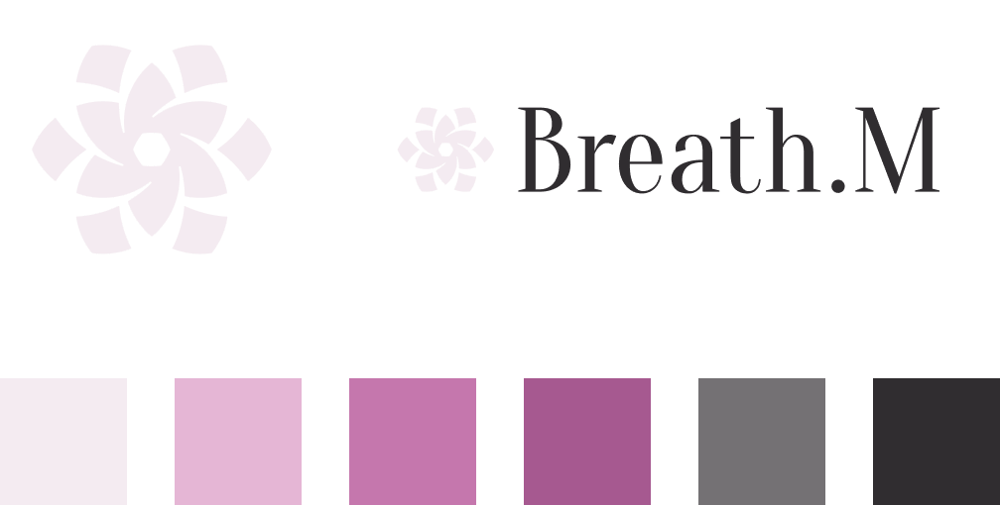
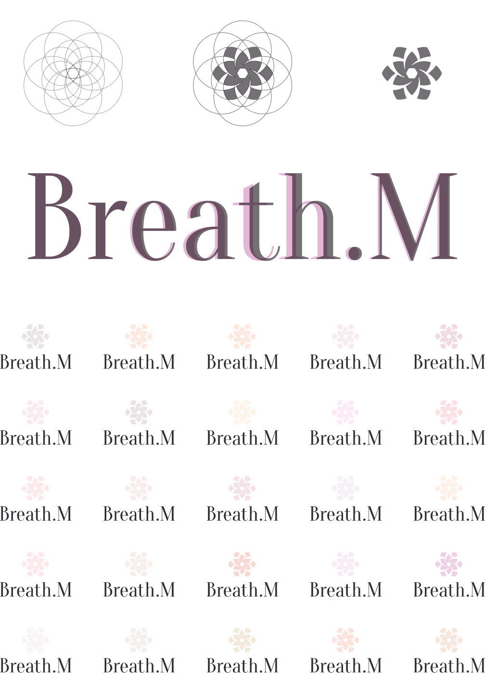

アパレル・アクセサリーブランド Breath.M（ブレスミー）

Breath.M の服を着ていれば、いつどこで誰と会っても自信がある。クローゼットを開けたときにワクワクできて、毎日でも着たい服として君臨する。ときめく毎日を演出してくれる。満ち足りた日々の中でしっかりと呼吸していると実感できる。そんな存在を目指したブランドです。

[ショップはこちら](https://breathm.thebase.in/)

新規立ち上げの中で BI 作成を担当しました。

## コンセプトの深掘り

初めに相談頂いた段階でもブランドのコンセプトやイメージカラーなど、かなり言語化されていました。

しかしいきなりデザイン制作に入ることはせず、その日に提案をしたのはちょっとしたワークショップです。

コンセプトとして出ていたのは、例えば「前向き」という言葉。その言葉のイメージを表している写真を探していただきました。全員で持ち寄り、お互いの考える「前向き」が何を指しているのかの共通理解をとる作業です。共通理解が得られたら今度はそれを具体的な言葉に変換……というのが提案した内容です。

というのも、更にコンセプトの言葉を掘り下げることでメンバーのビジョンの解像度が上がり、より良いブランドを作れるのではないか？と感じたためです。

これにより言葉の解像度が上がり、集めた画像はそのままムードボードとなりました。

## 制作過程

シンボルはガーデニアがモチーフです。それに加えて「Breath」を感じられるような形状にデザインしています。

ロゴタイプでベースにしたのは Oranienbaum というフォントです。B の腰の高さがこのブランドを纏った人の立ち姿と重なったため選びました。少しだけ形状を変更しています。

カラーリングは明るく淡い色で、それでいて消えて見えない色味を探りました。
