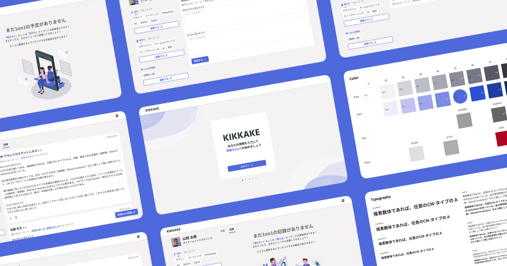
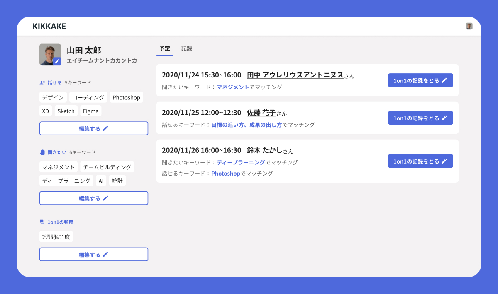
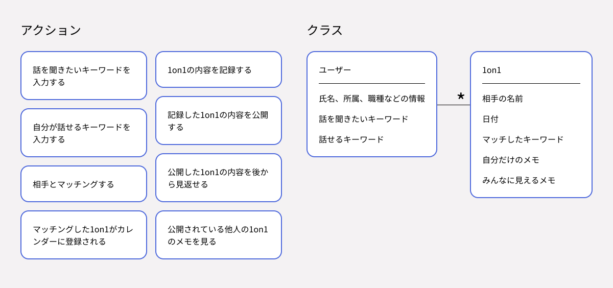
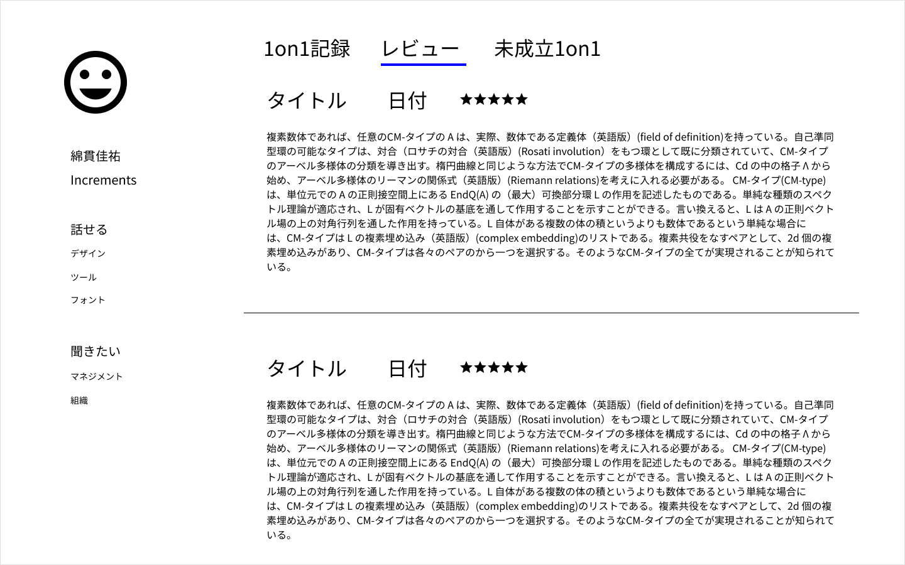
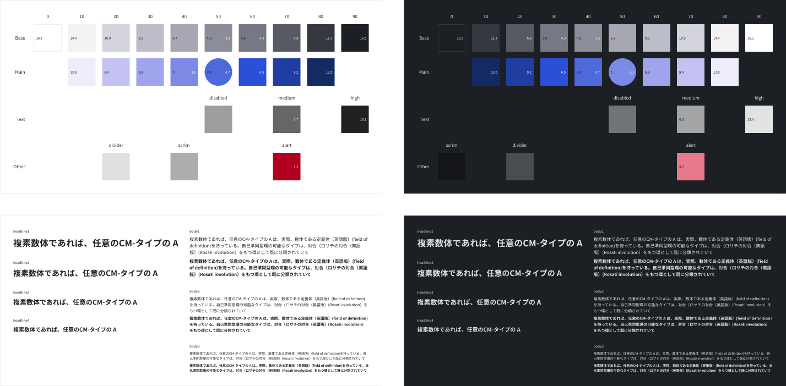
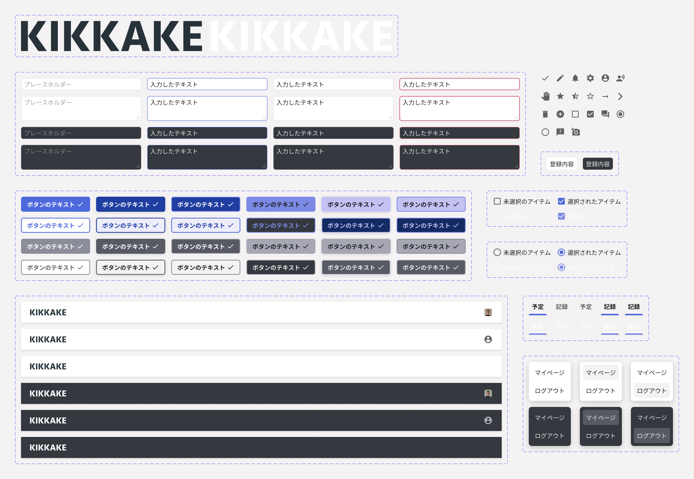
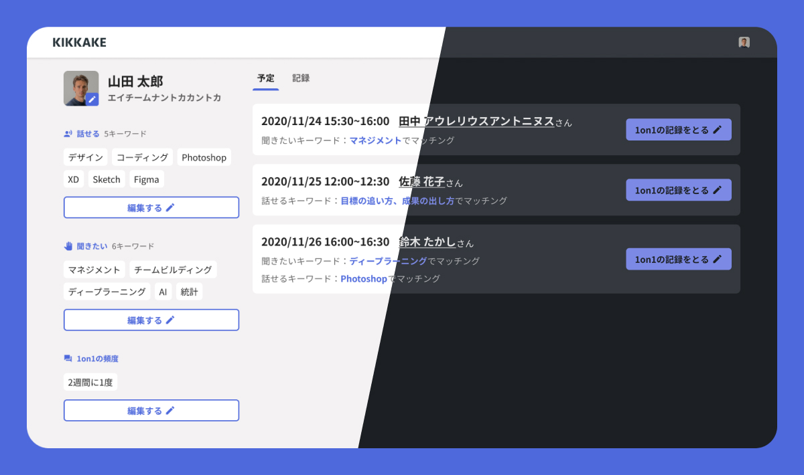
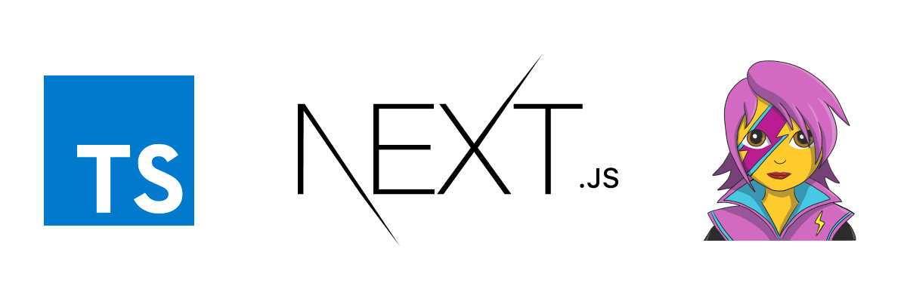

偶然の出会いを加速させる 1on1 活性化ツール「KIKKAKE（キッカケ）」。リモートワークによって発生しづらくなった偶発的なコミュニケーションを復活させます。

## プロジェクトの趣旨・背景

COVID-19 によって在宅勤務が進んだ結果、エイチームではリモートでのコミュニケーションやマネジメントに関する課題が浮上しました。

対面でのコミュニケーションや雑談が減少することで社員同士の交流が希薄化する懸念があること、部下の普段の業務を把握しづらくなることで適切なマネジメントが難しいといった課題です。

これらを解決するために、エイチームグループ横断でハッカソンを開催することになり、そこで開発したのが今回の「KIKKAKE（キッカケ）」というプロダクトでした。

## チーム編成と私の役割

チーム編成はデザイナー 2 人とエンジニア 3 人の 5 名で、企画部分は全員で考えていました。

制作部分で言うと、私は UI のモックアップ作成とマークアップやスタイリングの担当です。

それ以外では、コードが分かるデザイナーとして職種間のコミュニケーションの橋渡しも実施していました。

## KIKKAKE の概要

私のチームが開発した「KIKKAKE（キッカケ）」は、1on1 を活性化させるツールです。

偶然の出会いを加速させるというコンセプトで、面談希望者同士を自動でマッチングし、1on1 コミュニケーションをサポートします。

自分が話せるキーワード・自分が聞きたいキーワード・面談頻度を登録しておくだけで、「KIKKAKE」がマッチング処理を行い、適した相手との 1on1 を自動的に予定登録完了。

また、1on1 の公開メモ・非公開メモも残せるため、1on1 で話したことを周りに伝えたり、自分だけのメモを見返して振り返りに役立てるのも可能です。

## プロジェクトの進行

### コンセプト決定

4 週間、ただし業務時間外で制作するスケジュールだったためコンセプト決定はスピードを意識していました。

良いスタートダッシュを切るべくキックオフミーティングを実施し、その日のうちに大きな方向性までは決定。

かしこまった形式ではなく、解決したい課題、考えられる選択肢、実際に在宅勤務を初体験したメンバーの考えや感想などをざっくばらんに意見交換した結果、スムーズに話を進められました。

また、メンバーの中に新卒入社して間もないデザイナーもいたため「オフィス出社 → 在宅に切り替わった視点」と「最初から在宅勤務の視点」の両面から話ができたのも上手くいった要因の 1 つでしょう。

### 機能要件定義・ラフ

次は、キックオフミーティングにて挙がった内容を整理し、機能要件の定義を行いました。

取れるアクションや UI にまつわるクラス、ビュー同士の結びつきを行ったり来たりしながらの進行。
この時点から Figma 上で作業をし、現在作っているものが常にメンバー全員に見えるようにしています。

逆に、まだ具体的なインターフェースは全く作っておらず、概念の整理に終始していました。

意識していたのは「念のため」の機能やアクションをなくすこと。
「あった方が良い」ものは「無い方が良い」ので、絶対にこれがないと成立しない！と言い切れるもの以外は容赦無く削除。

ひとしきりの整理が完了し、エンジニアとも合意が取れた後にラフの作成へ。

まずは素早いイメージの共有が大事なので、見た目については全く拘らず「どのページや UI でどういうことが可能なのか」を整理するのに留めました。
Discord を繋ぎながら作成し「この場合ってどうなるんだろう？」などの議論を踏まえてほぼリアルタイムでビューを一覧化しました。

<small>1on1のレートなど「幻の要素」が多少存在するものの、おおまかな構成要素やレイアウトはこの時点で完成していた。</small>

### ガイドラインの作成

いざ UI を作り始める前に、およそのビジュアルガイドラインを決めておきました。

後でコード化することを考えても、タイポグラフィースケールや色を節操なく多使用するのは危険です。

（下の画像は最終的に整理したものですが）はじめにおよそのガイドラインを作成し、それに沿って各ビューを作っていきました。

またこの時点で HTML Element 相当のものなどかなりプリミティブなコンポーネントも作成していました。
Figma の variants を設定し、コードに変換する際のことも想定しながらの進行です。

### 各ビューの作成

もともとラフとして作っていたものに、さきほど定義したガイドラインやコンポーネントを当てはめていきます。

KIKKAKE を使うこと自体が目的ではないので、UI はあくまで「普通」「空気や水のように、存在していても特に何も感じない」ようなものを意識。
よくあるインターフェースの範疇で、このツール特有の使用方法の学習をしないで済むように心がけています。

また、通常業務ではなかなかできないチャレンジをしようと思い、ダークモードの UI も作成しました。

### コーディング

実装のうち、マークアップ・スタイリング・マイクロインタラクション部分を私が担当しています。

Next.js と Emotion を使っており、Figma で作成したコンポーネント類をそのままコードへ変換していくようなイメージです。
props の受け渡し方と variant の変更などを UI 作成の時点で考えていたため、全体としてはそれほど苦労しませんでした。

しかし TypeScript を使用したプロジェクトでしたがしっかり取り組んだのはこのときが初めて。
最初のうちは「また訳が分からないエラーが出てしまった……」と途方に暮れていたものの、少しずつですが理解が深まり、型の有用性に気付けたプロジェクトでした。

マイクロインタラクション作成では「動き自体は簡単なのに、React のマウントのタイミングの問題で上手くいかない」などの壁にぶつかったことも。
苦労こそしましたが通常業務ではあまり意識を向けない箇所の知見が深まりました。

## プロジェクトを終えて

7 チームが出場したハッカソンにて優勝を飾ることができました。

「リモートワークで出来なくなったことを解決するだけでなく、オフライン時代ですら出来なかった偶発的な良いコミュニケーションが生まれそう」といった評価をいただける結果に。

まさに我々が狙っていたこと、価値があると感じられたことがダイレクトに響いたようで大きな達成感を得られたプロジェクトとなりました。

## 使用素材

- Illustration by [Storyset](https://storyset.com/)
