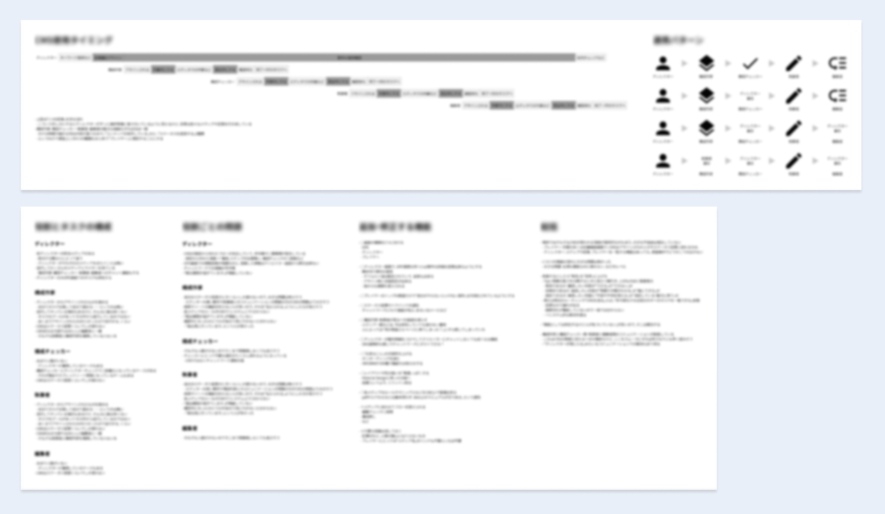
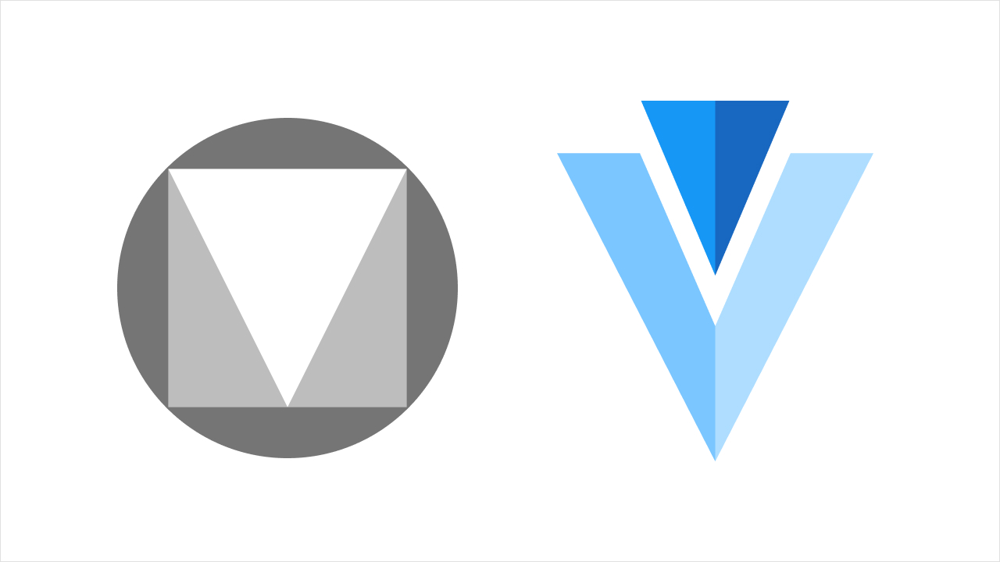

メディアエンジン株式会社様の記事制作ディレクションシステム。

既存の社内向けツールをアップデートするプロジェクトに参加しました。

担当範囲は課題の深掘りから UI モックアップの作成までです。

## 最終的な成果物

- 既存の機能は大きく変更せず
- ナビゲーションなど、情報設計を再確認して
- Material Design に準拠したシンプルな Master-Detail パターンに組み替え

詳細にはお見せできませんが、このようにデザインをしました。

## 既存システムの課題とデザインの方向性

相談いただいていた時点で、大別すると以下の課題がありました。

- これまで社内にデザイナーがいなかったため UI の見た目がツギハギになっている
- 業務フローとシステムの機能・UI が上手く対応しきれていない
- 機能としては存在していてもユーザーが知らない・扱いきれないものもある

これらの課題を解決と今後の運用を考えて、デザインは以下の方向性で進めることに決定。

- 社内ユーザーへのインタビューをもとに UI に落とし込む
- 私が作って終わりではなく、デザイン制作の考え方をメディアエンジン様に伝えながら進める
- 今後メディアエンジン様の中で運用・改修が出来るように UI フレームワークを使用する

## 社内ユーザーへのインタビュー

初めは社内で実際にシステムを使用しているユーザーへのインタビューから実施。

このステップではインタビュー設計と当日のモデレートを担当しています。

スクリプトを組みつつ、発話プロトコル法を用いて半構造化したインタビューを計 7 回実施しました。

プロジェクトの期日の関係もあり実施人数はやや少なめですが、多くの課題を発見することが出来ました。

その中でも特にフォーカスしたのは以下の 2 点。

- ディレクター職は見るべき箇所が多いものの、それが色々なページに点在しているため効率的にシステムを使用できない
- 逆にディレクター以外の職種が見るべき箇所は少ない。しかし画面に表示されている要素は多いため肝心の見るべき箇所が埋もれている

また、それ以外の箇所についてもインタビュー結果と分析をまとめてレポーティング。

課題が見つかると全てを解決したくなりがちですが、全貌を明らかにした上でフォーカスする場所を話し合い、極力早い完成を目指しました。

## UI 制作の考え方を伝えながらの進行

若干要件からは外れるのですが、私は「情報設計や UI 構築の理屈を伝えないまま完成品だけ納品してもあまり意味が無い」と考えていました。

事前ヒアリングで「社内にデザイナーがおらずエンジニアが都度改修を施している」と伺っており、デザイナー採用の難しい今、しばらくは似たような状況が続くだろう……と勝手に推測。

こういった状況で制作パートナーとして私に出来ることは何か。

考えた末の結論は「UI 制作の原理原則をお伝えすることで、現在のメンバーが将来もスムーズに運用できたら価値があるはず。」

1 人の外部デザイナーとしては差し出がましい考えかもしれませんが、提案した際には快諾していけだけました。

実際に行ったこととしては、オブジェクト指向 UI のモデルやインタラクションを画面に示しての説明や、よくある UI のアンチパターンの解説などがあります。

もちろん全てを説明できたとは思いませんが、多少なりとも UI 制作のプロセスをオープンにできたと思っています。

## 運用・改修がしやすいように UI フレームワークを使用

前のセクションの話と多少繋がりますが、今回アップデートしたとしてもその後上手く運用・改修できなくては意味がありません。

せっかく依頼いただいているのですから、作って終わりではなく長く価値を発揮するものを作りたいものです。

アップデート前の UI は Vuetify によって Material Design を実装していたため、そこは変えないまま制作することに決めました。

実は私はこの時点で Vue を使った経験がほとんどありませんでしたが急いでキャッチアップ。

幸いドキュメントが充実しており、そこまで苦戦することなくコンポーネントを選んだりレイアウトを組めました。

ここでも Material Design がどういう Principles を定義しているかといった話を交えながら制作を進めました。
