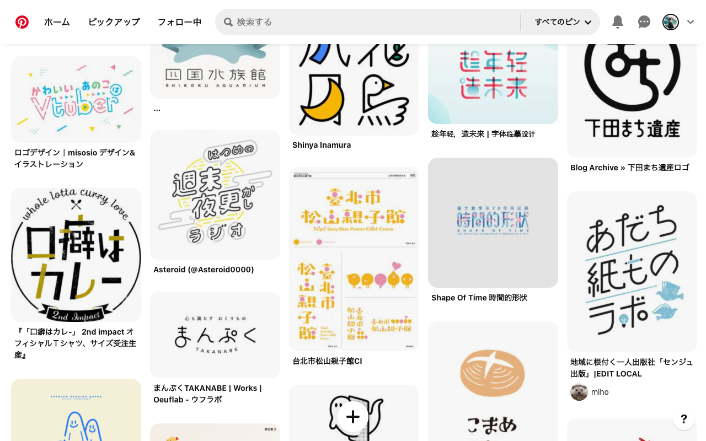
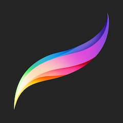
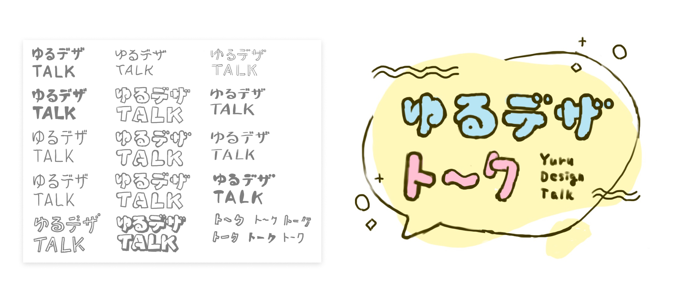
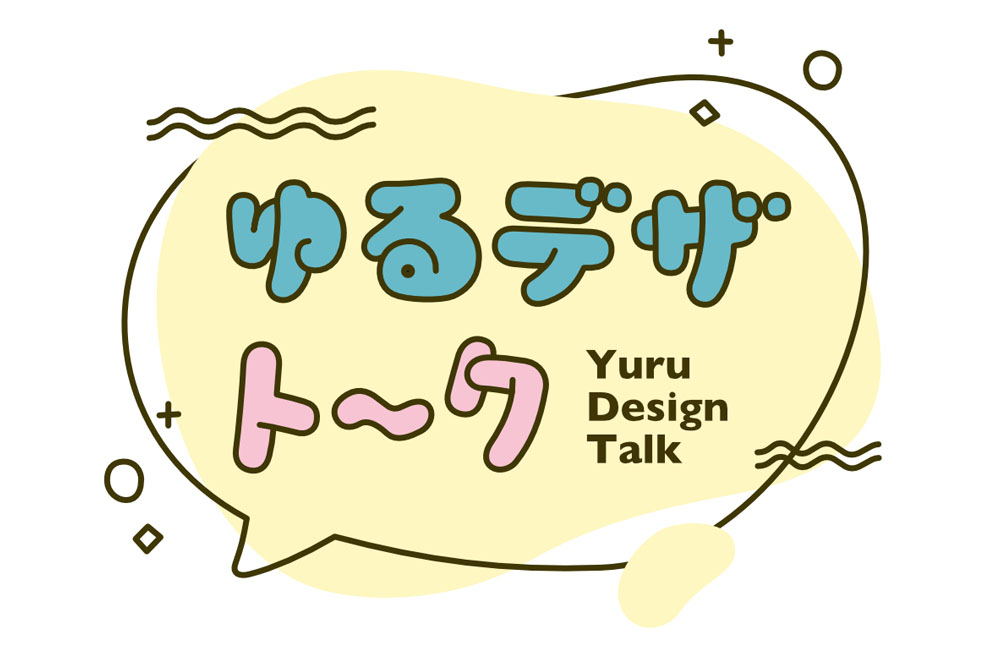
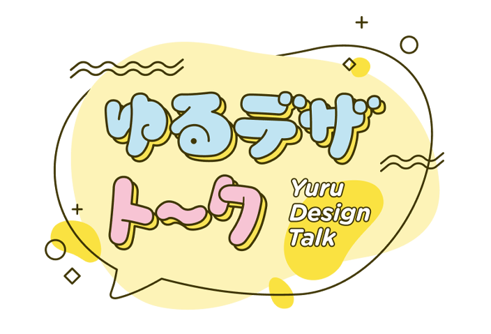
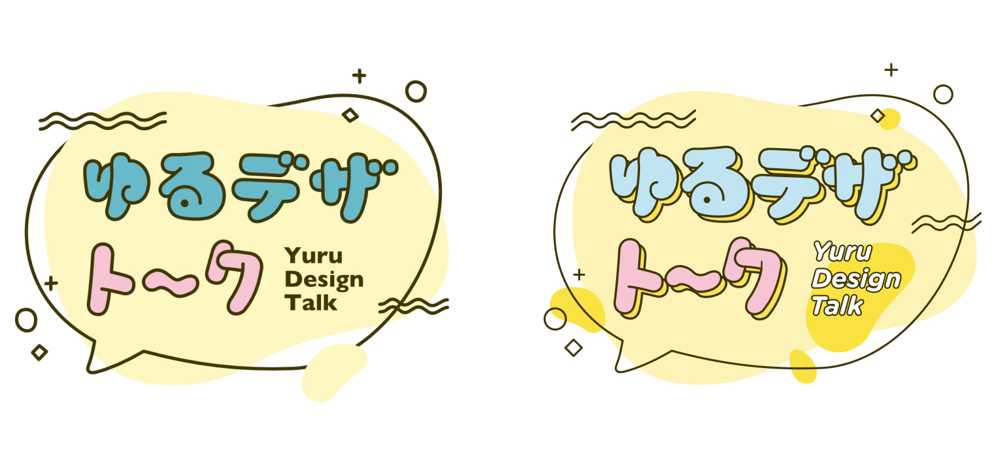

見知った仲間同士でクローズドな LT 大会を開催することになり、ロゴデザインを担当。

ロゴデザインの経験はあるものの「**イベントのロゴ**」に限るとほとんど作ったことがないのに気づき、取り組んでみました。

## ロゴの役割を考える

一口にロゴと言っても、サービスやブランドのロゴとイベントのロゴとだと、大事になるポイントが違うと思います。

ブランドのロゴは装飾の削ぎ落とされたものが多いですが、これは

- 紙とディスプレイ、どちらでも可視性を担保しないといけない
- 遠くから見ても「あのブランドだ」と分かる明快さが必要
- 看板くらいの大きさからファビコンくらいの小ささまで、スケールが違っても同じ印象を与えないといけない
- モノクロ印刷しか出来ないときでも「らしさ」を表現出来る必要がある
- 時間が経っても古くさくならない
- などなど……

上記のようにクリアすべき項目が非常にたくさんあり、なおかつ一度世に出したら簡単には変更出来ないため、自然と洗練された形状や色使いに収束するのではないでしょうか。

対して、イベントのロゴを比較してみると

- イベント自体のイメージを豊かに伝えたい
- ロゴ単体でもグラフィックとして使用しがち
- イベントの時期しか使わない

といった違いが挙がると思います。

汎用的な使い勝手よりはイベントに関連・特化した価値を出したい。そういった違いを念頭に置きながら制作に向かいました。

## ムードボード作成

手を動かす前にムードボード作成からとりかかりました。

イベント企画から当日まで日が短かったため、体裁は整えず Pinterest 上で画像を収集しただけのもの。

イベント名が「ゆるデザトーク」なので「**ロゴにおけるゆるさ**」を認識するのに一番時間をかけています。

クライアントがいる案件ではムードボード自体の見た目もある程度作り込みますが、自分のチーム内で認識を統一するだけであれば Pinterest のボードで完結させてしまうことが多いです。

## ラフ作成

頭の中で雰囲気は掴んだので、次はラフを描いていきます。今回は Procreate を使いました。

Procreate はイラストを描くツールで、本来ロゴデザインやグラフィックデザインをするためのものではありません。

では何故今回 Procreate を選んだのか？それは、初めから Photoshop や Illustrator で作業すると、つい整列やパスの綺麗さなどが気になってしまうからです。

ですが**線の綺麗さなんてラフ作成時に気にするべきではありません。**そのためあえてイラスト用ソフトを使って「**気にしなくて良いことに目が向かない**」ように仕向けました。

ちなみに紙とペンを選ばなかったのは、コピペとアンドゥは欲しかったからです。

作成時の画面を録画してありますので、こちらもご覧ください。

<iframe width='100%' height='320' src='https://www.youtube.com/embed/4sANqN2tRDE' frameborder='0' allow='accelerometer; autoplay; clipboard-write; encrypted-media; gyroscope; picture-in-picture' allowfullscreen></iframe>

色々案を出しましたが今回の案に決めたのは

- 字体が太い方がゆるくしやすかった
- 角張ってるより丸い方がゆるい
- 「TALK」よりも「ト〜ク」の方がゆるく見える
- 話すイベントなので吹き出しモチーフ

という理由です。やや言語化しきれていない感が否めないですが、デザイナーばかりのイベントなので精細に言語化せずとも文脈を共有できるであろう……と割り切って進めました。

## 清書

最終データは Affinity Designer を使って作成しました。ちなみに Affinity は今回が初使用。

余談ですが仕事以外の制作で自分に課しているルールとして「**今まで使ったことないツールを使うなど、何か 1 つチャレンジする**」があります。

そのため、購入してからほとんど使用していなかった Affinity を試してみました。

まずは iPad 版 Affinity Designer でパス化をしてみたのですが、なんだかラフの方が良かったように思います。

もう少し細かい調整をしたくなり今度は PC 版の Affinity Designer で作業しました。

同じソフトなのに iPad と Mac を切り替えたのは以下の理由。

- フォント管理を iPad でやるのが煩雑過ぎる
  - iPad にもフォント管理ソフトはあるものの、まだ発展途上な印象で見送っている
- 細かな調整は PC で行う方が楽
- デバイス間での連携を試してみたかった

ちなみにイラレと比較しても、明らかに物足りない点はありませんでした。
むしろ Affinity の方が便利な場面もチラホラ。

若干ロゴ制作の話から逸れてしまいましたが、かなり良い感触だったので今後他の Affinity シリーズも使ってみたいと思っています。

### ラフからの変更点

- 文字に落ち影っぽいグラフィックを追加
- 欧文フォントを rounded なものに変更
- 黄色の blob のうち濃いもの追加
- 字間・色・線幅の調整

変更量は大したことないですが、並べてみると良い感じで「ゆるく」なったのではないでしょうか。

